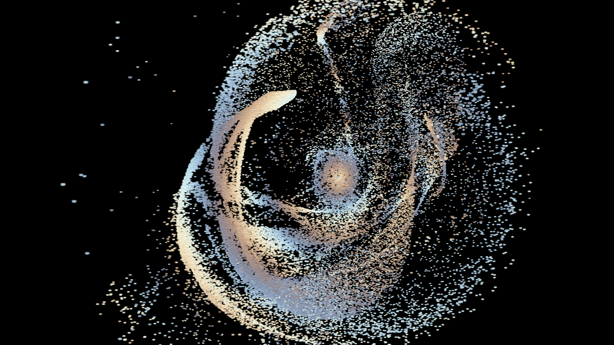

# Particle System

### Usage
`./ParticleSystem [particle_count]`

#### Keymap:  
**WASD**  - move around  
**SPACE** - toggle gravity  
**G**     - lock gravity at cursor position  
**F**     - toggle freecam  
**E**     - emit particles  
**Q**     - toggle between points and billboards mode  
**R**     - toggle fullscreen  
**I**     - toggle debug info HUD  
**1**     - sphere init  
**2**     - cube init  


### build
```
git clone --recursive https://github.com/indiedriver/ParticleSystem
cd ParticleSystem
cmake .
```



